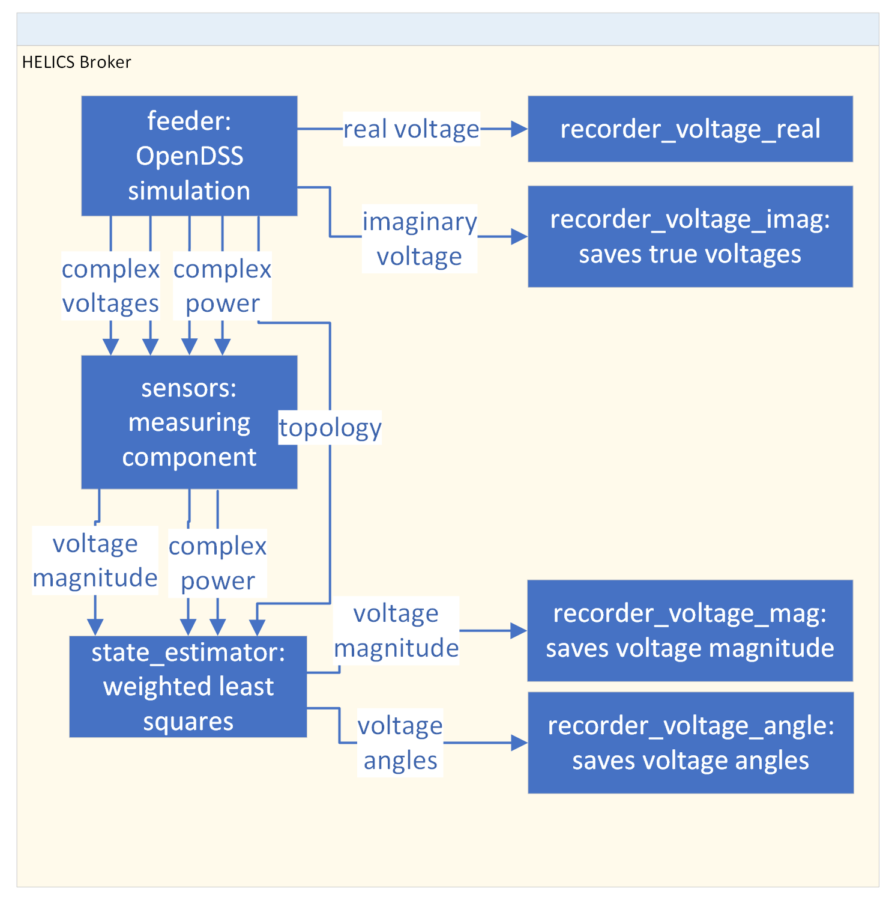
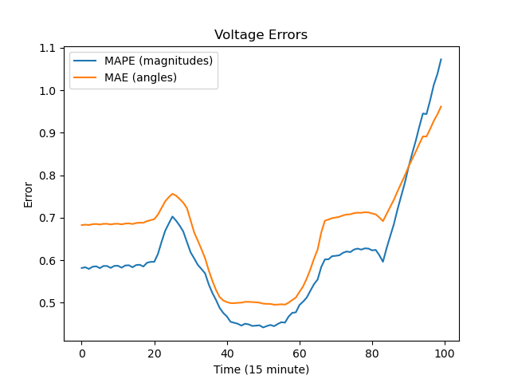
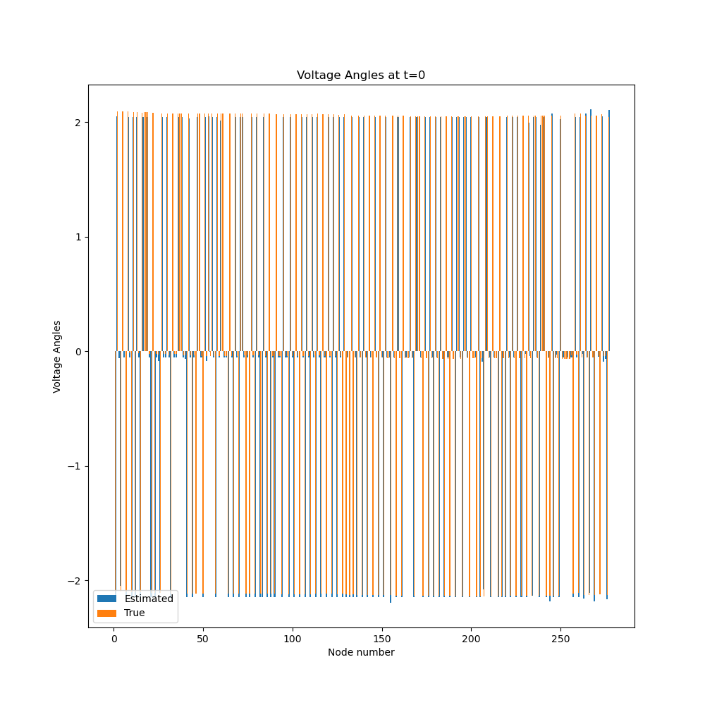
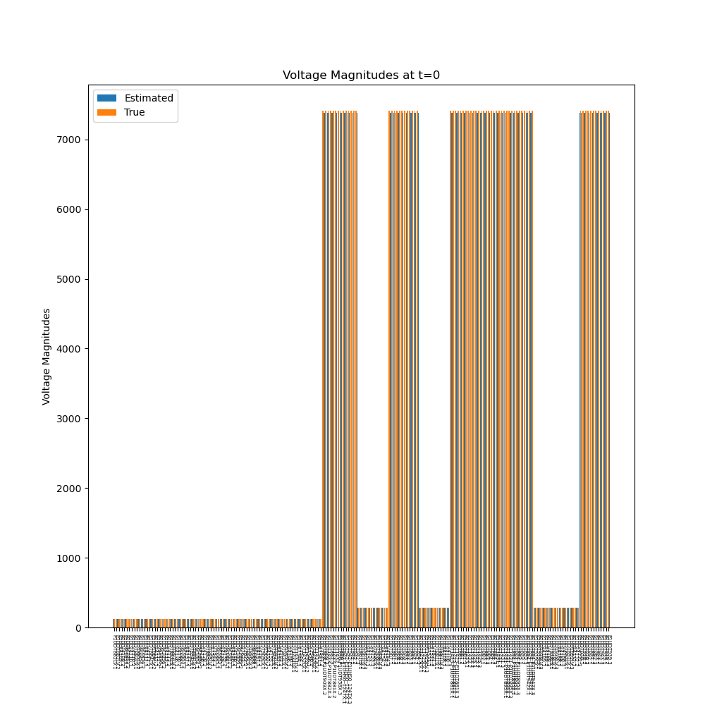
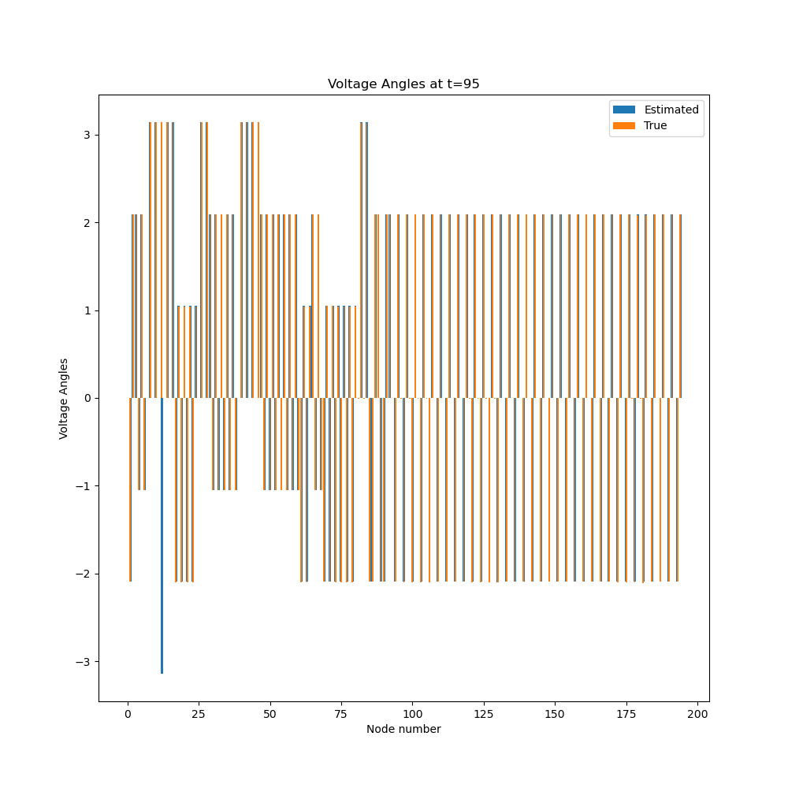

# SGIDAL-example


1. Install the SGIDAL `componentframework` using `python setup.py develop` along with its dependencies. You'll also need the HELICS CLI, `opendssdirect`, `pyarrow` in addition to the usual `scipy`, `matplotlib`, `numpy`, and `pandas`.
```
pip install 'OpenDSSDirect.py[extras]'
pip install git+https://github.com/GMLC-TDC/helics-cli.git@main
pip install pyarrow
pip install scipy matplotlib numpy pandas
```
2. Run `python test_full_systems.py` to initialize the system
3. Run `helics run --path=test_system_runner.json`
4. Analyze the results using `python post_analysis.py`

## Troubleshooting

If the simulation fails, you may **need** to kill the `helics_broker` manually before you can start a new simulation.

When debugging, you should check the `.log` files for errors. Error code `-9` usually occurs when it is killed by the broker as opposed to failing.

# Components 

All the required components are in this repo as well. Each component
also defines its own pydantic models at present.



## BasicFeeder

An OpenDSS simulation with a SMART-DS feeder. Some preprocessing has been done
(contact Junkai Liang) to match previous work. It outputs
- topology: Y-matrix, slack bus, initial phases, and unique ids for each nodes
and a labeled array with floats and `unique_ids` for each entry: (1)
`powers_real`, (2) `powers_imag`, (3) `voltages_real`, and (4) `voltages_imag`.

## `measuring_federate`

The measuring federate outputs absolute voltages and complex voltages at specified nodes. The `measuring_federate` can also add Gaussian
noise with given variance.

## `wls_federate`

The state estimation federate reads the `topology` from the feeder simulation
and measurements from the measuring federate. Then the federate outputs the
filled in voltages and power with angles.

## `recorder`

The `recorder` federate can connect to a subscription with a labelled array, and
then will save it to a `data.arrow` file.

# How was the example constructed?

For each component, you need a `component_description.json` with
information about the inputs and outputs of each component.

A basic system description with the `test_system.json` is also
needed for the simulation.

In `test_full_systems.py`, we load in the various `components_description`s and
the wiring diagram `test_system.json`. The system is initialized and then the
`test_system_runner.json` is saved. During this process, directories are created
for each component with the right configuration.

# Results








