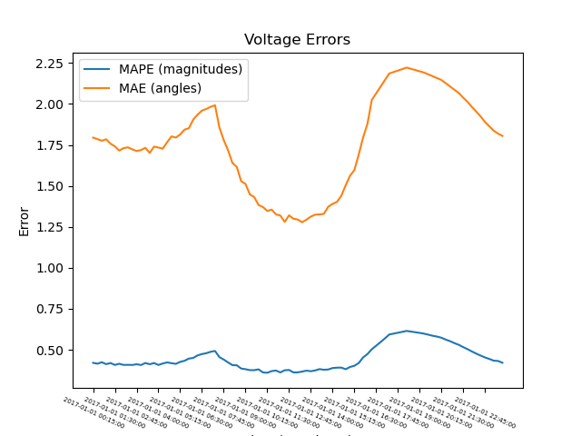
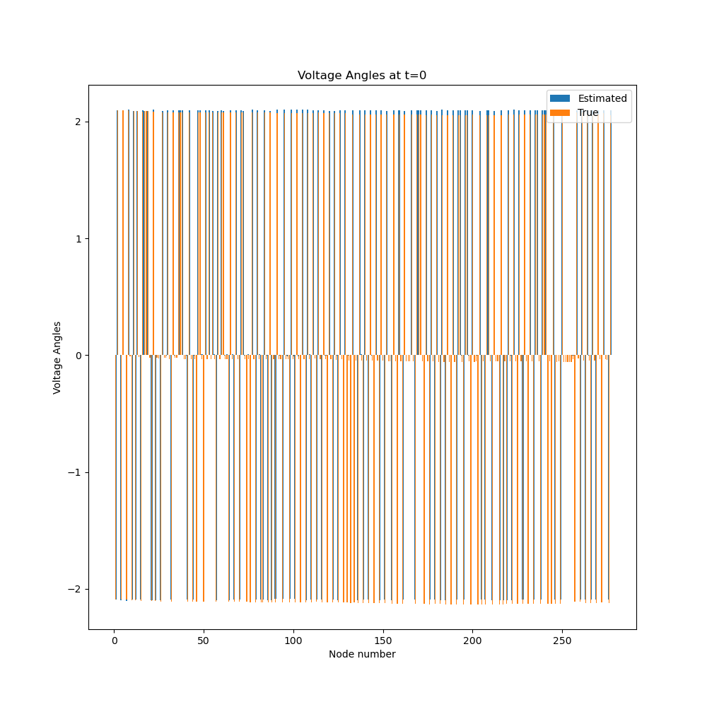
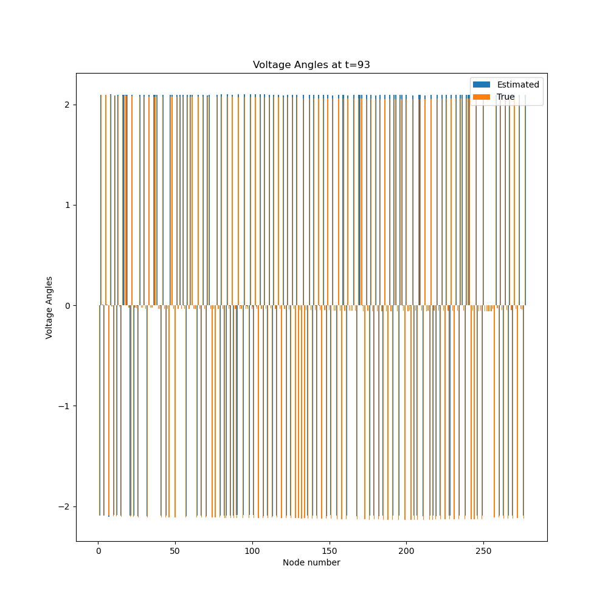
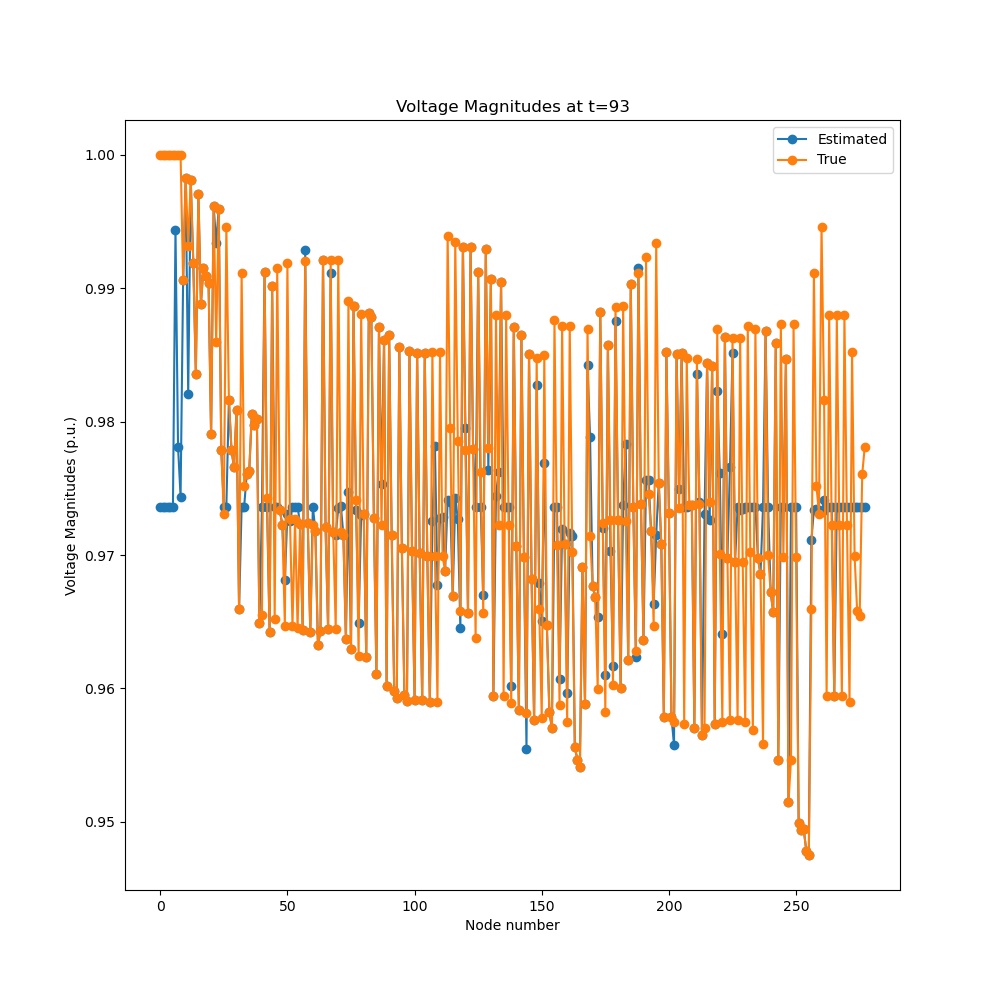

# oedisi-example

This example shows how to use the GADAL api to manage simulations. We also
use it as a testing ground for the testing the combination of feeders,
state estimation, and distributed OPF.

# Install and Running Locally

1. To run the simulation, you'll need several libraries such as OpenDSSDirect.py and pyarrow.
```
pip install -r requirements.txt
```
2. Run `oedisi build --system scenarios/docker_system.json` to initialize the system
defined in `scenarios/test_system.json` in a `build` directory.

You can specify your own directory with `--system` and your own system json
with `--system`.

3. Run `oedisi run`
4. Analyze the results using `python post_analysis.py`

This computes some percentage relative errors in magnitude (MAPE) and angle (MAE),
as well as plots in `errors.png`, `voltage_magnitudes_0.png`, `voltage_angles_0.png`, etc.

If you put your outputs in a separate directory, you can run `python post_analysis.py [output_directory]`.

## Troubleshooting

If the simulation fails, you may **need** to kill the `helics_broker` manually before you can start a new simulation.

When debugging, you should check the `.log` files for errors. Error code `-9` usually occurs
when it is killed by the broker as opposed to failing directly.

You can use the `oedisi` CLI tools to help debug specific components or timing.

- `oedisi run-with-pause`
- `oedisi debug-component --foreground feeder`

# Components

All the required components are defined in folders within this repo. Each component
pulls types from `oedisi.types.data_types`.


## Component definitions

Our components use `component_definitions.json` files in each directory to define what
their dynamic inputs and outputs are. This allows us to configure these when
we build the simulation.

## AWSFeeder

An OpenDSS simulation which loads a specified SMART-DS feeder. It outputs
- topology: Y-matrix, slack bus, initial phases
- powers
- voltages

## `measuring_federate`

The measuring federate can take MeasurementArray inputs and then output subsets at specified nodes.
The `measuring_federate` can also add Gaussian noise with given variance.

This federate is instantiated as multiple sensors for each type of measurement.

## `wls_federate`

The state estimation federate reads the `topology` from the feeder simulation
and measurements from the measuring federates. Then the federate outputs the
filled in voltages and power with angles.

## `recorder`

The `recorder` federate can connect to a subscription with a measurement array, and
then will save it to a specified `.arrow` file as well as a `.csv` file.

This component is instantiated multiple times in the simulation for every subscription of interest.
This is similar to the HELICS observer functionality, but with more specific data types.

# How was the example constructed?

For each component, you need a `component_description.json` with
information about the inputs and outputs of each component.
We created component python scripts that matched these component
descriptions and followed the GADAL API for configuration.

In order to use the data types from other federates, the `oedisi.types`
module is critical. If additional data is needed, then we recommend
subclassing the pydantic models and adding the data in the required federates
as needed. This ensures that others should still be able to parse your types if
necessary. Using compatible types is usually the most difficult part of integrating
into a system.

A basic system description with the `test_system.json` is also
needed for the simulation.

In `test_full_systems.py`, we load in the various `components_description`s and
the wiring diagram `test_system.json`. The system is initialized and then the
`test_system_runner.json` is saved. During this process, directories are created
for each component with the right configuration.

# Results









# Docker Container

```
docker build -t oedisi-example:0.0.0 .
```

To get a docker volume pointed at the right place locally, we have to run more commands
```
mkdir outputs_build
docker volume create --name oedisi_output --opt type=none --opt device=$(PWD)/outputs_build --opt o=bind
```

If `pwd` is unavailable on your system, then you must specify the exact path. On windows, this will end up
being `/c/Users/.../outputs_builds/`. You must use forward slashes.

Then we can run the docker image:
```
docker run --rm --mount source=oedisi_output,target=/simulation/outputs oedisi-example:0.0.0
```

You can omit the docker volume parts as well as `--mount` if you do not care about the exact outputs.
