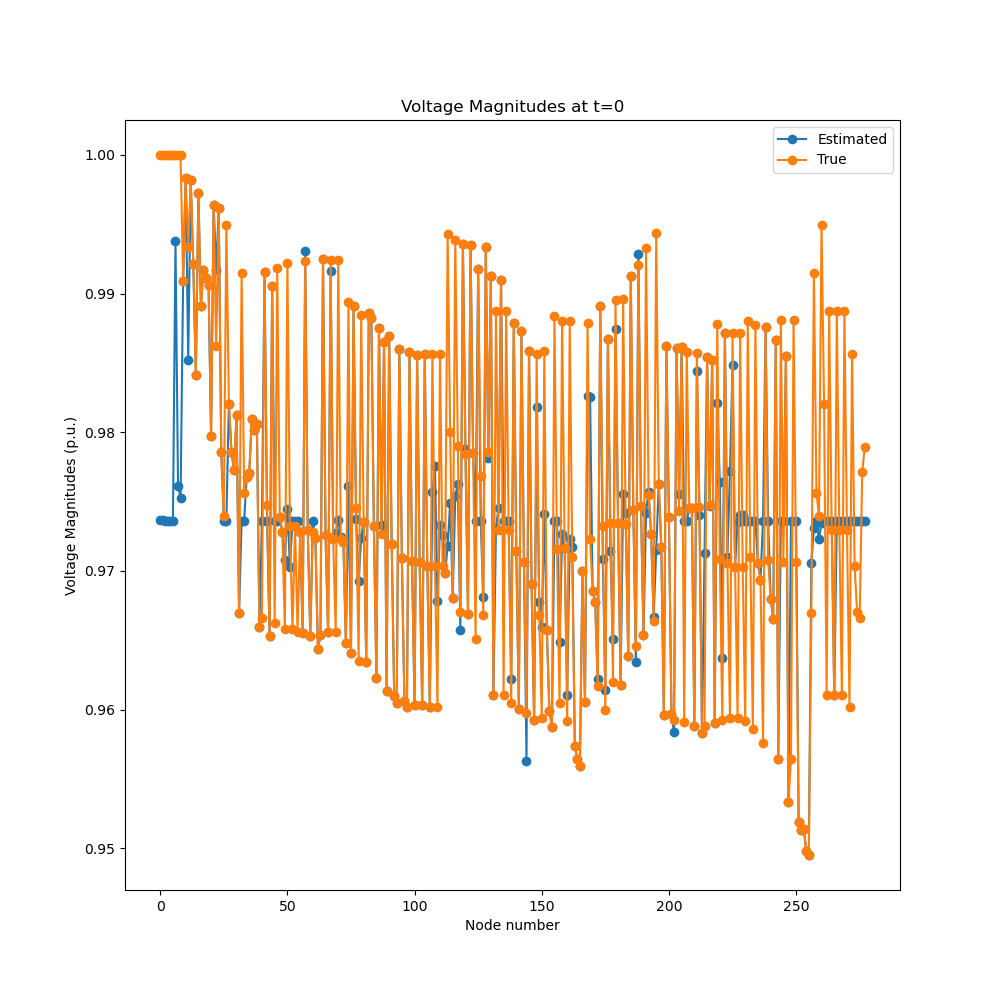

# SGIDAL-example


1. Install the SGIDAL `componentframework` using `python setup.py develop` along with its dependencies. You'll also need the HELICS CLI, `opendssdirect`, `pyarrow` in addition to the usual `scipy`, `matplotlib`, `numpy`, and `pandas`.
```
pip install 'OpenDSSDirect.py[extras]'
pip install git+https://github.com/GMLC-TDC/helics-cli.git@main
pip install pyarrow
pip install scipy matplotlib numpy pandas
```
2. Run `python test_full_systems.py test_system.json` to initialize the system
3. Run `helics run --path=test_system_runner.json`
4. Analyze the results using `python post_analysis.py`

### Using IEEE123 test system

2. Run `python test_full_systems.py test_ieee123.json` to initialize the system
3. Run `helics run --path=test_system_runner.json`
4. Analyze the results using `python post_analysis.py`

## Troubleshooting

If the simulation fails, you may **need** to kill the `helics_broker` manually before you can start a new simulation.

When debugging, you should check the `.log` files for errors. Error code `-9` usually occurs when it is killed by the broker as opposed to failing.

# Components 

All the required components are in this repo as well. Each component
also defines its own pydantic models at present.


## BasicFeeder

An OpenDSS simulation with a SMART-DS feeder. Some preprocessing has been done
(contact Junkai Liang) to match previous work. It outputs
- topology: Y-matrix, slack bus, initial phases, and unique ids for each nodes
and a labeled array with floats and `unique_ids` for each entry: (1)
`powers_real`, (2) `powers_imag`, (3) `voltages_real`, and (4) `voltages_imag`.

## `measuring_federate`

The measuring federate outputs absolute voltages and complex voltages at specified nodes. The `measuring_federate` can also add Gaussian
noise with given variance.

## `wls_federate`

The state estimation federate reads the `topology` from the feeder simulation
and measurements from the measuring federate. Then the federate outputs the
filled in voltages and power with angles.

## `recorder`

The `recorder` federate can connect to a subscription with a labelled array, and
then will save it to a `data.arrow` file.

# How was the example constructed?

For each component, you need a `component_description.json` with
information about the inputs and outputs of each component.

A basic system description with the `test_system.json` is also
needed for the simulation.

In `test_full_systems.py`, we load in the various `components_description`s and
the wiring diagram `test_system.json`. The system is initialized and then the
`test_system_runner.json` is saved. During this process, directories are created
for each component with the right configuration.

# Results





### Modification of SGIDAL-Example to Run DOPF

1. In addition to the SGIDAL installation dependencies, some more dependencies are required for OPF. You can install them using 

```
pip install -r requirements.txt
```

After running this command, the final dependency is IPOPT. 
A prebuilt ipopt binary can be put into your python executables '/bin/' folder. 
Based on your OS, binaries can be downloaded from: https://www.coin-or.org/download/binary/Ipopt/
install all other requirements using 
2. Running the DOPF Example

`./run_ieee123_with_opf.sh`

The shell script contains two lines

```python test_full_systems_with_opf.py test_ieee123_with_opf.json`
helics run --path=test_system_runner.json```

`test_ieee123_with_opf.json` contains federate definitions, configuration files and the links between source and targes

`test_full_systems_with_opf.py` uses `test_ieee123_with_opf.json`
to generate directories of all federates and prepares the helics runner file `test_system_runner.json` 

3. To kill the simulation run
`./kill.sh`

4. To clean the directory to get rid of .log files
`./clean.sh`

5. To analyze the results run the file
`python opf_plots.py`

# Components 

All the required components are in this repo as well. Each component
also defines its own pydantic models at present.


## DOPF Federate
This is the new federate that has been made in this example.
The inputs and outputs for this new federate follow the same configuration
of the generic `component_description.json` structure.
The exact definition can be found in `opf_federate_123PV/component_definition.json`
